# 사용자 수에 따른 규모 확장성

## 단일 서버, 단일 데이터베이스 

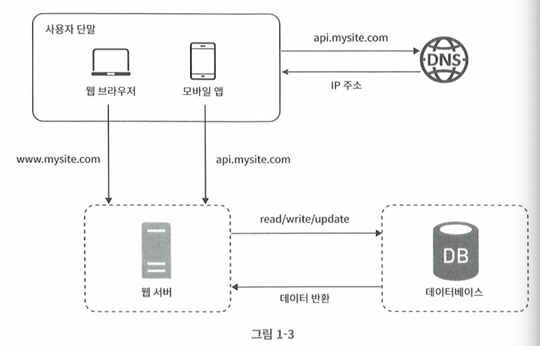

- PC/Mobile에서 도메인 주소를 DNS서버에 요청하면 실제 IP주소를 알려주고, 웹서버의 실제 서버로 접속하게 된다. 
- 단일 웹서버가 요청을 모두 처리한다.
- 단일 서버에서 하나의 데이터베이스에 접근하여 정보에 대한 CRUD가 발생한다. 

### 특징

- 웹 서버의 capacity에 따라 유입될수 있는 사용자에 대한 한계가 결정된다. 
- 웹 서버의 역할은 다음과 같다. 
  - 사용자의 요청에 따른 화면 렌더링을 직접 수행한다. 
  - 요청이 들어오면 서버 자체 해결 및 데이터베이스에 저장된 데이터에 대해서 CRUD가 일어난다. 
  - 웹 서버가 WAS와 WEB Server 모든 역할을 수행해야한다. 
- 서버의 장애, DB의 장애시 시스템 전체가 장애가 된다. 

### 데이터베이스 

- 데이터베이스는 관계형 데이터베이스와 비-관계형 데이터베이스로 나눠진다. 
- 관계형 데이터베이스 (RDBMS)
  - MySQL, MariaDB, Oracle, PostgreSQL
  - 각 자료와 자료들이 관계를 가지고 잇으며 1:1, 1:N, M:N 관계로 상호 연결이 된다. 
  - 각 테이블들은 Join을 통해 관계형 테이블에서 데이터를 조회한다. 
- 비 관계형 데이터베이스 (NoSQL)
  - 데이터 전통적인 관계형 데이터베이스 형태가 아닌, 시스템 특성에 맞는 구성을 가진다. 
  - 키-값 저장소(key-value store): 
    - redis, memcached 등
  - 칼럼 패밀리 저장소 
    - 칼럼들 기반으로 데이터가 저장되며, 조회, 집계등역시 칼럼을 기준으로 조회한다. 
    - HBase
  - 그래프 저장소(Graph Storage)
    - 그래프 형태로 저장되며, 회원들의 친구관계 등을 매우 쉽게 효율적으로 관리한다. 
    - Neo4J
  - 문서 저장소(Document Storage):
    - MongoDB, DocumentDB
- 데이터베이스의 선택
  - 매우 낮은 Latency 필요시
  - 데이터 형식이 비정형 데이터인경우, 각 상황에 따라 다양한 칼럼등이 들어올수 있음
  - 대규모 데이터의 저장

### NoSQLs

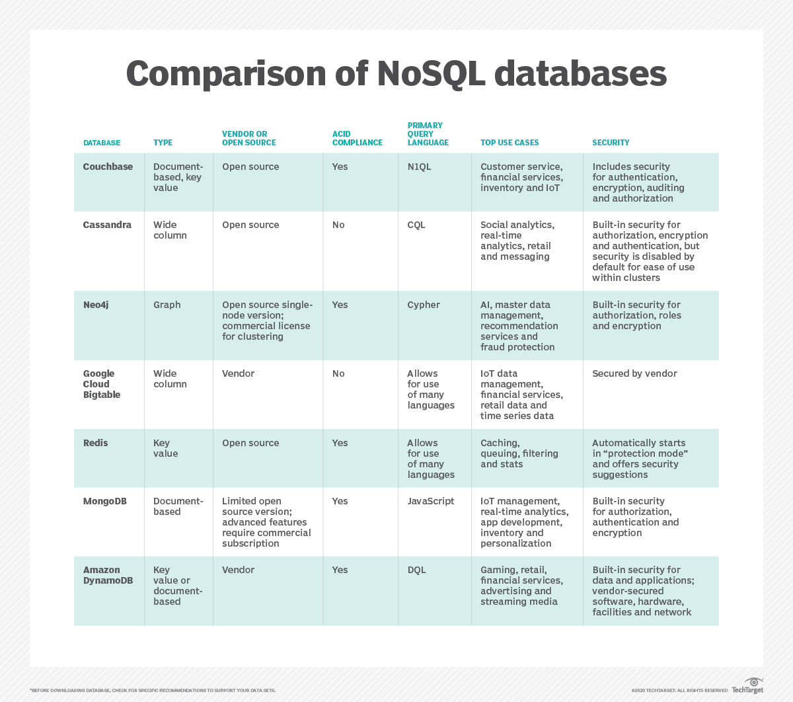

from: https://www.techtarget.com/searchdatamanagement/infographic/NoSQL-database-comparison-to-help-you-choose-the-right-store

## ScaleUp & ScaleOut

- 수직적 규모확장 
  - Oracle 등과 같이 단일 서버, 단일 Master 구조의 서버에서는 수직적 규모 확장만 지원
  - 수직적 규모확장은 비용/물리적 제한이 존재
- 수평적 규모확장
  - 동일한 사양을 수평으로 분산하여 성능을 극대화 
  - DB의 경우 쓰기는 1대이지만 읽기는 여러 리플리카를 두어 성능 향상 

## 로드밸런서

- 한대의 서버의 문제점을 극복하기 위해서 LoadBalancer를 두어 장애에 대비 (이중화를 수행)

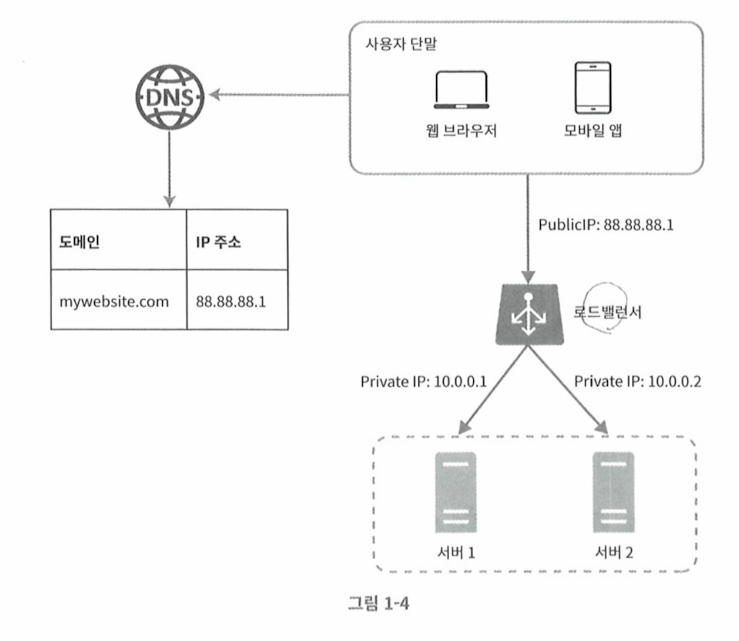

- 도메인과 LoadBalancer의 IP 주소를 바인딩한다. 
- 로드밸런서 뒷부분에는 PrivateIP를 통해서 여러대의 서버를 준비하고 서비스를 수행한다. 
- 한대의 서버가 장애가 생겨도 나머지 서버로 서비스 연속성 유지 

## 데이터베이스 다중화 

- 한대의 쓰기모드와 여러대의 읽기(replicas)를 두어 서비스의 안정성을 향상 

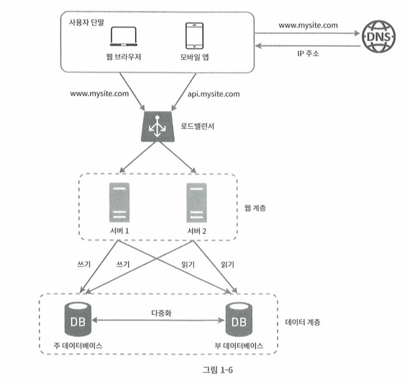

- 여러대의 서버가 쓰리를 할대에는 주 데이터베이스 이용
- 읽기를 수행 할 때에는 부 데이터베이스를 조회
- 읽은 데이터를 바로 사용할대에는 읽기 모드로 접근해야 복제 시간차이에 의한 데이터 없음 이슈를 해결할 수 있음 

## 캐시

- 캐시는 데이터베이스 혹은 시간이 걸리는 데이터를 캐시해두었다가, 사용자의 요청에 빠르게 대응하기 위한 방안으로 사용

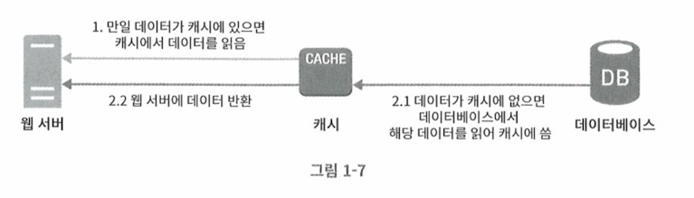

- 유의점
  - 캐시 사용은 언제 하는가? 
    - 갱신은 자주 일어나지 않지만 조회는 빈번한 경우 고려하기
  - 캐시 데이터는 어떤 데이터를 저장하는가?
    - 캐시 데이터는 메모리를 주로 사용하므로 일시적인 데이터를 저장해야함
  - 캐시 만료시간은 언제인가? 
    - 캐시 만료 기간이 짧으면 캐시를 두는 효과가 떨어짐
    - 캐시 만료 기간이 너무 길면 데이터의 신선도가 떨어짐
  - 일관성
    - 실제 데이터 변경이 발생하면 캐시도 함께 갱신해야 데이터의 신선도가 올라감
  - 단일 장애지점
    - 캐시는 데이터 요청앞에서 먼저 수행되므로, 캐시 서버의 오류는 전체 장애가 될수 있음 
    - 그러므로 캐시 접속이 어려운경우 FailFast를 수행하고 바로 DB조회하도록 조정 필요 
    - 분산캐시 전략 필요 
  - 캐시 자체의 용량
    - 캐시 용량이 작으면, 매번 데이터가 캐시에서 밀려나므로 캐시 히트율이 떨어짐 
  - 데이터 방출
    - 데이터가 캐시에서 비워지는 전략이 필요
    - LRU(Least Recently Used): 마지막으로 사용된 시점이 가장 오래된 데이터를 제거
    - LFU(Least Frequently Used): 사용빈도가 가장 낮은 데이터를 제거 
    - FIFO(First In First Out): 가장 먼저 캐시에 들어온 데이터를 가장 먼저 내보니는 정책

## CDN (Content Delivery Network)

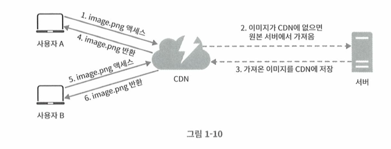

- 컨텐츠, 정적 데이터등을 사용자에 가장 가까운 CDN에 보관하고, 사용자 요청시 컨텐츠를 전달
- 컨텐츠가 존재하지 않은경우 origin 서버에서 데이터를 가져가서 캐싱해둠
- 고려사항
  - CDN 비용 - 서드파트가 많으므로 비용 고려픽요
  - 만료시한 - CDN은 일종의 캐시이므로 컨텐츠가 얼마나 오래 캐시될수 있는지 정책이 필요, 너무 길면 데이터가 오래된 데이터가되며, 너무 짧으면 서버에 자주 요청하므로 부하 증가
  - 장애대처 - CDN서버는 컨텐츠 데이터를 제공하므로, CDN이 죽었을때 서버에서 해당 컨텐츠를 내려보낼수 있는 전략이 필요
  - 컨텐츠 무효화 - CDN 데이터 만료기간이 도래하기 전에 새로 변경딘 컨텐츠를 제공해야할 때 컨텐츠 무효화 할 수 있도록 방안 필요
    - 업체가 제공하는 무효화 기능 이용
    - 컨텐츠 조회 경로에 랜덤값 등을 써서 컨텐츠 최신화 (image.png?v=222323)

## 무상태 웹 계층

- 사용자, 요청에 대한 상태를 저장하는 방식을 상태저장 웹계층이라고 한다. 
- 그러나 수평 확장을 위해서는 상태를 가져서는 수평확장에 제약이 오게 된다. 

### 상태저장 웹 계층 

- 사용자가 접속하면 서버는 사용자의 정보를 상태 저장소 (세션)에 저장한다. 
- 그리고 사용자는 자신이 접속한 서버로만 접속을 하게 되며, 세션정보를 바탕으로 자신의 정보를 세션으로 부터 조회하는 방식이다. 
- 이를 위해서 sticky session 을 로드밸런서에 설정을 해야하며, 부하가 한쪽으로 몰리면 서버는 이를 해지할 방법이 없다. 
- 서버가 다운되면 가지고 있던 모든 상태정보가 사라지기 때문에, 고객은 다시 로그인을 해야하는 상황이 만들어진다. 

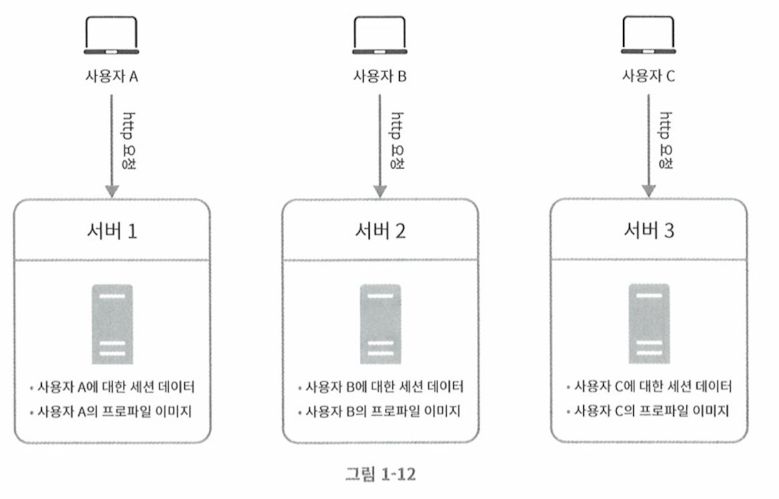

### 무상태 웹 계층

- 상태 저장 웹과는 반대로, 사용자의 정보를 특정 서버에 저장하지 않는다. 
- 사용자 정보는 분산캐시(공유저장소) 등에 저장하고, 요청이 들어오면 어떠한 서버에서든지 사용자 정보를 캐시에서 조회하여 서비스를 진행할 수 있게 된다. 
- 즉, 요청이 들어올때마다 서비스할 서버가 달라져도 서비스를 올바르게 진행할 수 있다는 것이다. 
- 스케일 아웃을 위해서는 무상태 계층으로 서버를 구성해야한다. 

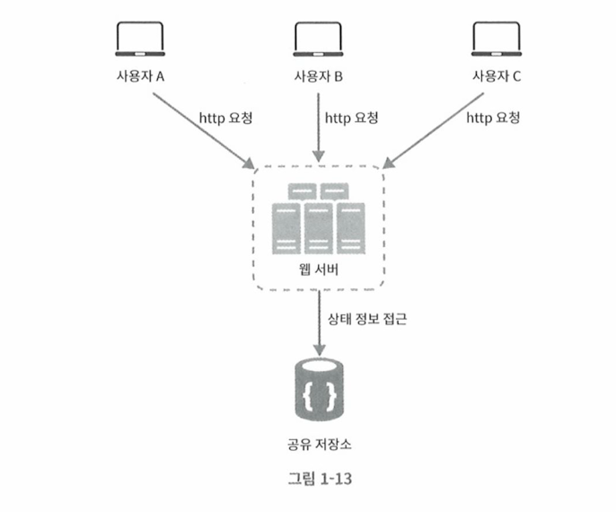

- 위 그림과 같이 공유 저장소에 사용자 상태를 저장한다. 

### 최종 아키텍처

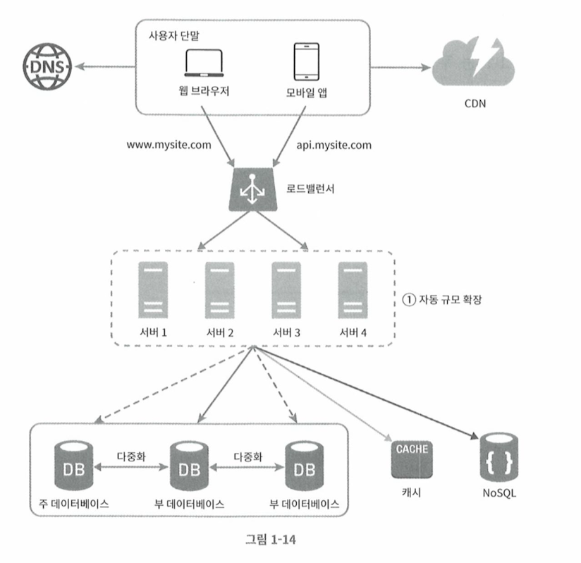

- 위 그림은 최종적인 단일 존에 서비스를 구성한 예제이다. 

## DataCenter

- 대형화재, 재난, 전쟁 등으로 인해 데이터 센터 장애가 발생한경우 서비스는 완전히 불능 상태가 된다. 
- 이를 대비하기 위해서 분산된 데이터센터에 시스테을 구성하여 DR을 달성할 수 있다. 

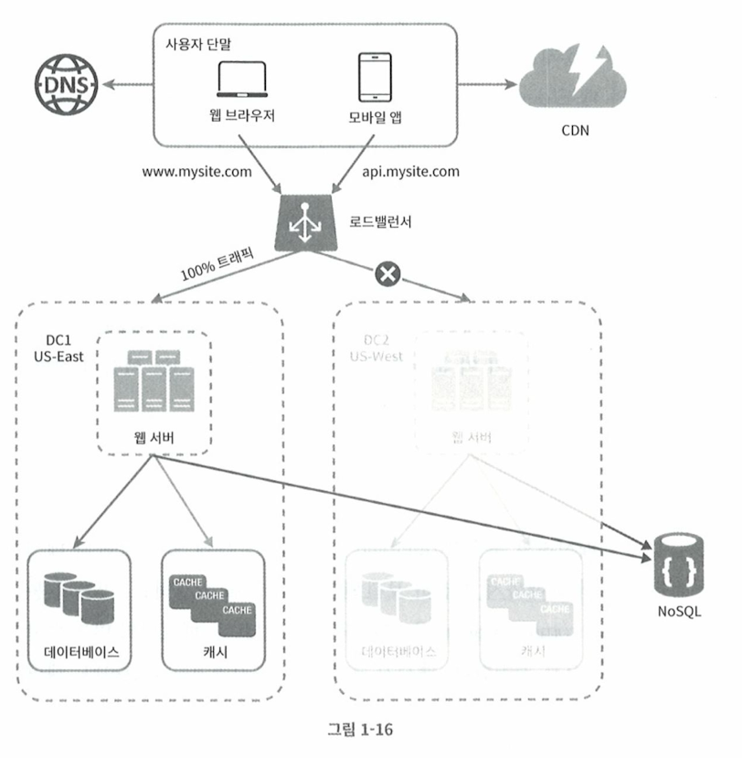

- 위와 같이 데이터센터 장애가 발생하더라도, 안정적인 존으로 서비스가 연결이 된다. 
- 또한 존이 다르게 두어서 좀더 고객에 근접한 시스템에 접근하여 접근 성능을 개선하는 경우도 있다. 
- 그림에서 보이는것과 같이, 동일한 섭비스를 진행하기 위해서 데이터베이스는 상호 동기화가 되어야한다. 이 점은 쉬운 문제가 아니다. 

## 메시지큐

- 메시지는 pub/sub 사이의 상호 연관, 의존관계를 끊는 방법으로 이용되는 아키텍처이다. 
- 즉, 느슨한 결합, 규모의 확장성이 용이하다. 
- 처리가 비동기로 수행될 수 있다면 메시지 큐를 이용할 수 있다. 

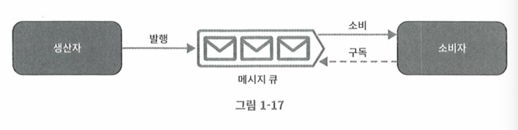

## 데이터베이스 규모확장

### 수직확장

- CPU, RAM 등을 향상시켜서 시스템의 성능을 극대화 하는 방법이다. 
- AWS의 인스턴스를 상향조정하는 방법등 
- 한계:
  - 하드웨어의 물리적한계, 더이상 증설하지 못하는 경우가 발생한다. 
  - SPOF 단일 실패지점으로 장애발생 위험성이 크다. 
  - 비용이 많이든다. (장비, 라이선스등)

### 수평확장

- 데이터베이스는 샤딩을 통해서 데이터베이스를 확장할 수 있다. 
- 수평샤딩, 수직샤딩 등이 있다. 
- 수직샤딩: 
  - 파티셔닝등의 개념으로 읽기/쓰기/오퍼레이션의 편의를 위해서 사용한다. 
- 수평샤딩:
  - 샤드키에 따라 데이터를 분할 저장하고, 조회하는 방법이다. 

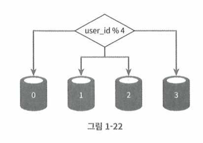

### MultiMaster

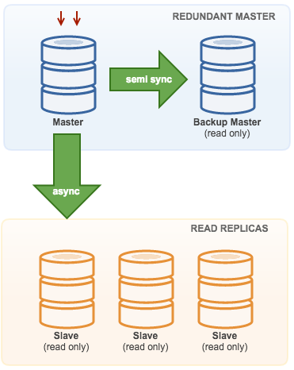

- Master 에서 쓰기를 수행하고, Slave에서 읽기를 처리한다. 
- Backup Master은 주기적으로 Active Master의 bin-log를 통해서 계속해서 동기화 한다. 
- Active Master가 다운되면 Backup Master가 Active Master로 승격하고, 서비스를 빠르게 이어간다. 
- bin-log가 잘 동기화 된다면 1분 남짓 시간으로 서비스가 재개된다. 

from: https://severalnines.com/resources/whitepapers/mysql-replication-high-availability/

### 샤딩 고려사항

- 데이터의 재 샤딩: 
  - 샤드를 더 추가해야하는 경우(샤드소진) 분배 문제가 발생한다. 
  - 일반적 방법을 이용하는 경우 rehash로 인해서 데이터가 다시 조정되는 부하가 발생할 수 있음 
  - 하여 샤드 키 전략이 매우 중요하다. 
- hotsopt key / celebrity 문제:
  - 하나의 샤드에 쓰기/읽기가 집중되어 시스템의 성능을 저하시키는 현상
  - 조회가 많은 키마다 샤드 키를 나누는 방법
  - 하나의 키를 더 잘게 쪼개서 샤드를 나누는 방법
- 조인/비정규화: 
  - 샤드를 쪼개고 나면 조인이 어렵다. 
  - 물리적으로 분리된 서버로 조인이 불가능하기 때문이다. 
  - 데이터베이스를 비정규화 하여 하나의 테이블에서 질의가 가능하도록 설계 

## 최종 아키텍처

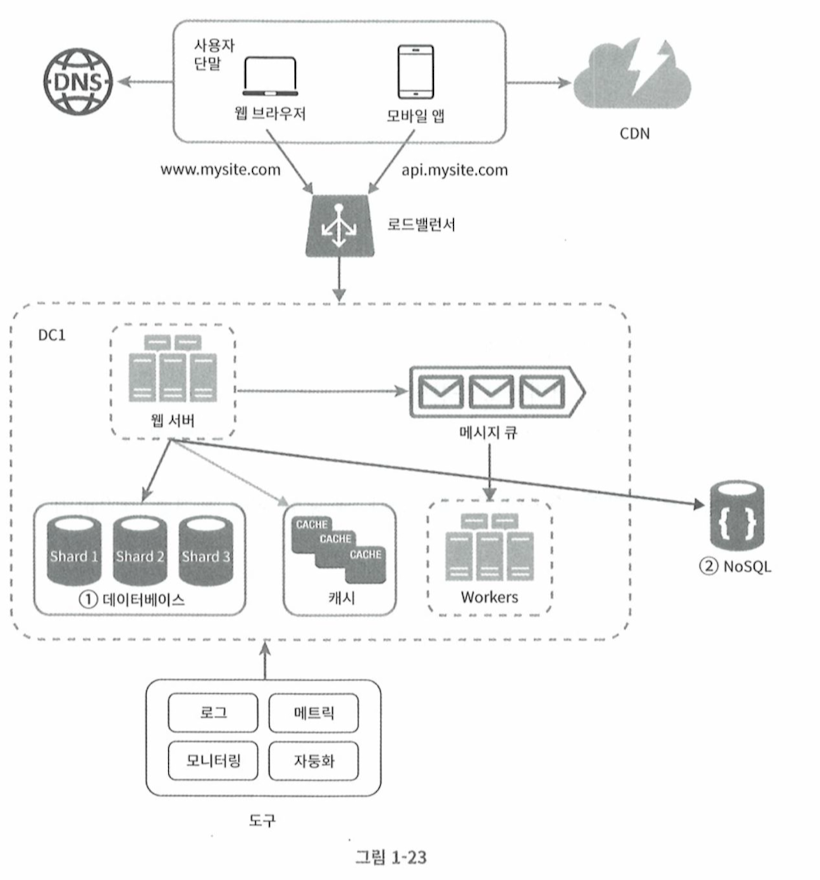

## 더 많은 확장을 위한 고려사항

- 웹 계층은 무상태 계층으로 개발
- 모든 계층에 다중화 도입
- 가능한 한 많은 데이터를 캐시하기
- 여러 데이터 센터를 지원하기
- 정적 콘텐츠는 CDN을 통해 서비스 하기
- 데이터 계층은 샤딩을 통해 그 규모를 확장하기
- 각 계층은 독립적 서비스로 분할하기
- 시스템을 지속적으로 모니터링하고, 자동화 도구들을 활용하기 

