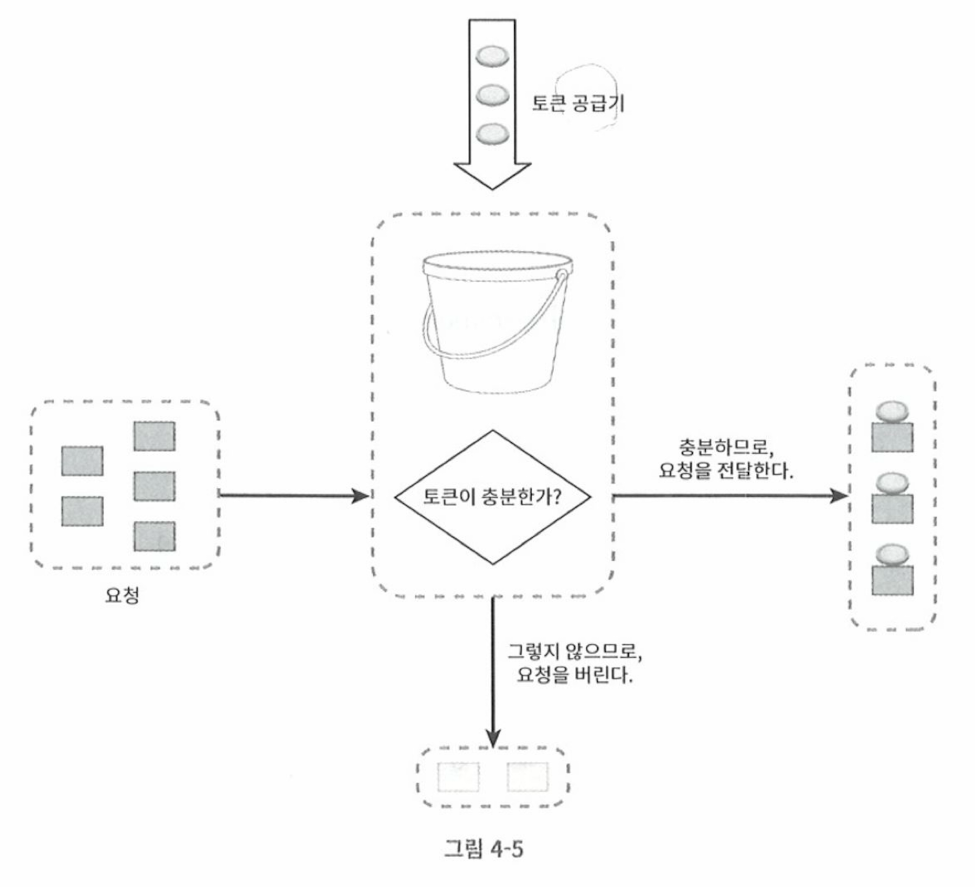
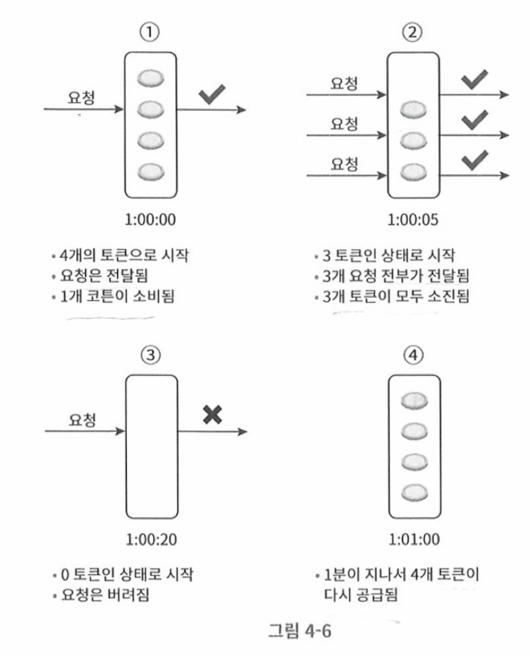

# 토큰 버킷 알고리즘

- 토큰 버킷 알고리즘은 처리율 제한에 폭넓게 이용된다. 
- 간단하며, 알고리즘 이해도가 높다. 

## 동작원리 

- 토큰버킷: 
  - 지정된 용량을 갖는 컨테이너
  - 사전에 설정된 양이, 주기적으로 채워진다. 
  - 예)
    - 버킷크기 = 4
    - 매초마다 2개의 토큰 발급
    - 버킷이 가득 차면 추가로 공급된 토큰은 버려진다. 

- 위 그림은 버킷크기에 대해서 매 일정주기로 토큰이 채워진다. 
- 그리고 요청이 들어오면 토큰이 버킷에 존재하는지 확인하고, 존재하면 토큰을 받아 업무 처리를 수행한다. 
- 주기마다 버킷이 찰때 이미 버킷에 토큰이 들어 있다면 잉여 토큰은 버려진다.
- 버킷에 토큰이 없으면 요청은 버려진다. 

## 버킷구성 전략

- 하루 1번 포스팅, 친구등록 150명제한, 좋아요버튼 5번 --> 사용자마다 총 3개의 버킷 두기 
- IP주소별 처리율 제한 적용 --> IP주소마다 버킷 하나씩 할당
- 시스템 처리율 초당 10,000개 요청 --> 하나의 버킷을 모든 요청이 공유

## 장/단점

### 장점

- 구현이 쉽다.
- 메모리 사용 측면에서 효율적이다. 
- 짧은 시간 집중되는 트래픽 처리가능
- 버킷에 남아있는 토큰이 있다면 요청이 처리를 시작할 것이다. 

### 단점

- 버킷크기, 토큰 공급율 2개의 인자를 가짐 --> 튜닝이 쉽지 않다. 

