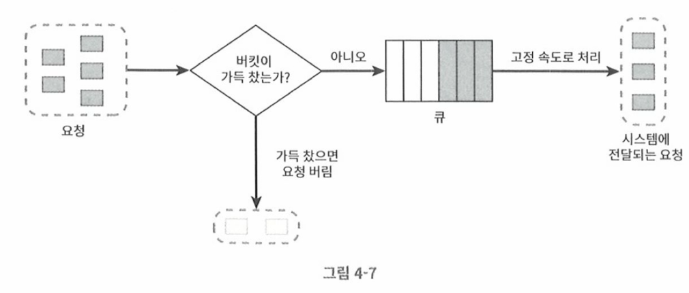

# 누출 버킷 알고리즘

- 토큰 버킷 알고리즘과 유사함
- 처리율이 고정되어 있는점이 다름
- 보통 FIFO 큐로 구현한다. 

## 동작원리

- 요청이 도착하면 큐가 가득차 있는지 확인한다. 빈 자리가 있는경우 큐에 요청 추가
- 큐가 가득 차 있는 경우에는 새 요청을 버린다. 
- 지정된 시간마다 큐에서 요청을 꺼내 처리한다. 

- 버킷크기: 큐 크기와 같은 값, 처리될 항목이 저장될 크기가 된다. 
- 처리율(outflow raw): 지정된 시간당 몇개의 항목을 처리할지 지정하는 값 (초단위)

## 장점/단점

### 장점

- 큐 크기가 제한되어 있어, 메모리 사용이 효율적이다. 
- 고정된 처리율을 갖고 있으므로 안정적 출력이 필요한경우 적합

### 단점

- 단 시간에 많은 트래픽이 몰리는 경우 큐에 오래된 요청이 쌓이고, 처리되지 못하면 최신 요청은 버려짐
- 두 개의 인자가 있어 튜닝이 쉽지 않다. 

