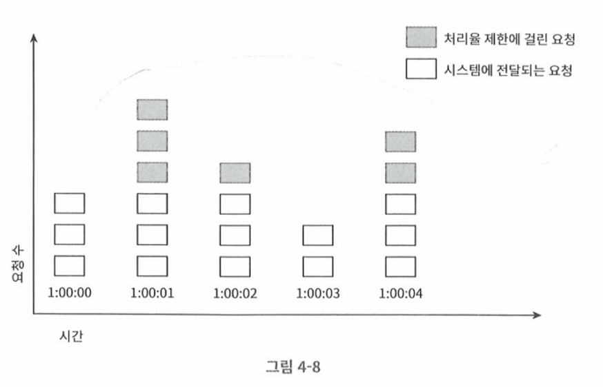
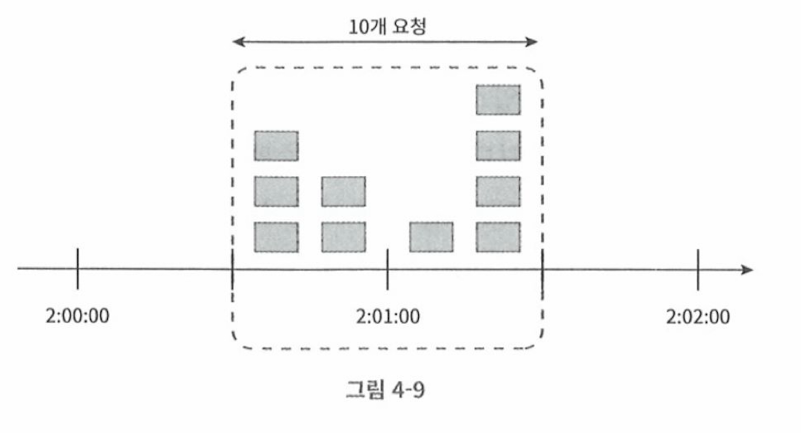

# 고정 윈도 카운터 알고리즘

- 윈도 크기마다 카운트를 세어, 처리율을 제한한다. 

## 동작방식 

- 타임라인을 고정된 간격의 윈도로 나누고, 각 윈도마다 카운터가 존재
- 요청이 접수될 때마다 이 카운터의 값이 1 증가
- 카운터의 값이 사전에 설정된 임계치에 도달하면 새로운 요청은 새 윈도가 열릴때 까지 버려진다. 

- 위 설정은 초당 3개 요청만 허용되는 윈도 
- 3개 이상이 들어오면 이후 요청은 버려짐

- 위 예제는 1분당 5개 처리를 허용하는 고정윈도우 카운터 알고리즘이다. 
- 매 00~01 분 사이라면 5개의 요청이 정상적인것으로 보인다. 
- 그러나 만약 00:30 ~ 01:30 으로 다시 보면 분당 10개가 처리된 잘못된 상황이 됨 

## 장점/단점

### 장점

- 메모리 효율이 좋다. 
- 이해하기 쉽다. 
- 윈도가 닫히는 시점에 카운터를 초기화하는 방식은 특정한 트래픽 패턴을 처리하기에 적합

### 단점

- 윈도 경계부근에 일시적인 트래픽이 몰리면, 기대한 시스템의 처리한도보다 많은 양의 요청이 처리된다. 

