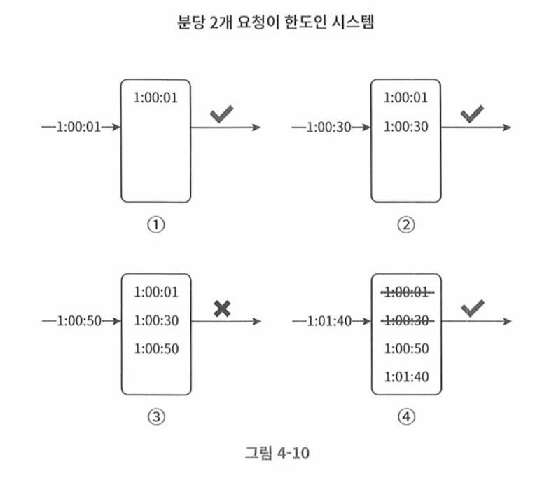

# 이동 윈도 로깅 알고리즘

## 동작방식

- 요청 타임스탬프를 추적한다. 
- 타임스탬프 데이터는 redis의 sorted set 같은 캐시에 저장
- 새 요청이 오면 만료된 타임스템프는 제거한다. 만료된 타임스탬프는 그 값이 현재 윈도의  시작 시점보다 오래된 타임스탬프이다. 
- 새 요청의 타임스탬프를 로그에 추가한다. 
- 로그의 크기가 허용치보다 같거나 작으면 요청을 시스템에 전달한다. 그렇지 않은경우 처리를 거부한다. 

- 요청이 1:00:01에 도착했을때, 로그가 비어 있고, 요청이 허용된다. 
- 새로운 요청이 1:00:30에 도착한다. 해당 타임스탬프가 로그에 추가된다. 추가 직후 로그의 크기는 2, 허용한도 이내이므로 요청이 처리됨
- 새로운 요청이 1:00:50에 도착한다. 타임스탬프가 로그에 추가된다. 추가직후 로그의 크기는 3이되고 허용한도를 넘어서므로 요청이 거부된다. 
- 새로운 요청이 1:01:40에 도착한다. 
- [1:00:40, 1:01:40)범위 안에 있는 요청은 1분 윈도 안에 있는 요청, 1:00:40 이전의 타임스탬프는 전부 만료된 값, 따라서 두 개의 만료된 타임스탬프 1:00:01과 1:00:30을 로그에서 삭제, 삭제이후 로그의 크기는 2이다. 따라서 1:01:40의 신규 요청은 처리된다. 

## 장점/단점

### 장점

- 처리율 제한 메커니즘을 아주 정교하게 구현한다. 
- 어느 순간의 윈도우를 보더라도 허용되는 요청의 개수는 처리한도를 넘지 않게 된다. 

### 단점

- 거부된 요청의 타임스탬프도 보관하므로, 메모리 소모량이 크다.

