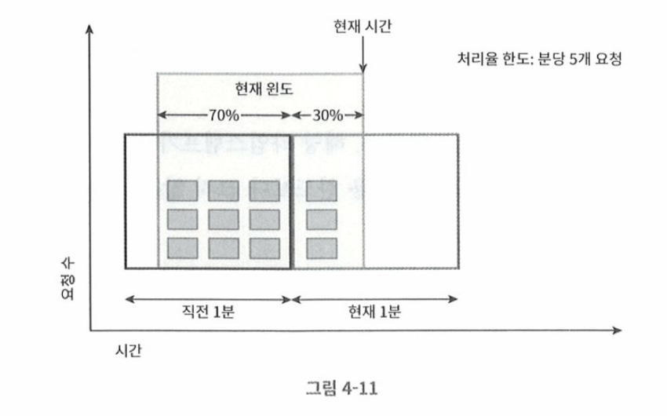

# 이동 윈도 카운터 알고리즘

- 고정윈도 카운터 알고르짐과 이동 윈도 로깅 알고리즘의 결합

## 동작방식 

- 분당 7개 요청 설정
- 이전 1분동안 5개 요청
- 현재 1분동안 3개 요청
  

- 현재 1분간 요청수 + 직전 1분간 요청수 * 이동 윈도와 직전 1분이 겹치는 비율
- 3 + 5 * 70% = 6.5개 --> 내림한경우 6 

- 분당 7개의 요청이므로 현재 1분의 30% 시점에 도착한 신규 요청은 시스템으로 전달됨
- 이후에는 한도에 도달했으므로 더이사 요청 받지 못함

## 장점/단점

### 장점

- 이전 시간대의 평균 처리율에 따라 현재 윈도의 상태를 계산하므로 짧은 시간에 몰리는 트래픽에도 잘 대응
- 메모리 효율이 좋다. 

### 단점

- 직전 시간대에 도착한 요청이 균등하다고 가정하므로, 느슨한 처리

