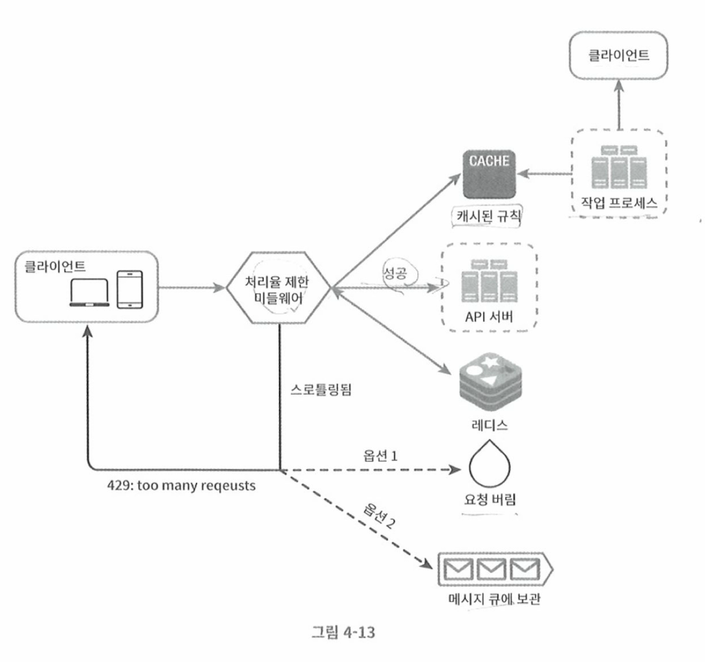

# 처리율 제한 장치 설계

- 클라이언트 서버 환경에서 특정 기간내 보내야하는 요청 횟수를 제한해야하는 경우
- 지정된 임계치 (Threshold) 를 넘은경우 Block 처리하는 기능

## 사례

- 사용자가 초당 2회 이상의 새 글을 올릴수 없도록 제한할때
- 같은 IP 주소로 하루에 10개 이상의 계정을 생성할 수 없게 할때
- 같은 장치로 주당 5회 이상 리워드를 요청할 수 없도록 할때. 

## 효과

- 처리율 제한장치를 사용하면 다음과 같은 장점이 있다. 

### DoS(Denial of Service) qkddj

- DoS 공격으로 인한 자원 고갈 방지
- 트위터: 3시간에 300개의 트윗만 가능
- 구글독스 API: 분당 300회의 read만 허용
- 추가요청 이상은 블록 되므로 DoS 공격을 방어할 수 있다. 

### 비용절감

- 서버가 많이 필요하지 않고, 처리가능한 정도만 유지하면 되므로 비용 절감

### 서버 과부하 방지

- 허용된 수치의 트래픽만 수용하므로 서버 과부하를 방지할 수 있다. 

## 알고리즘

- 토큰버킷(token bucket)
- 누출버팃(leaky bucket)
- 고정 윈도 카운터(fixed window counter)
- 이동 윈도 로그(sliding window log)
- 이동 윈도 카운터(sliding window counter)

## 처리율 제한기 구현예

## 분산 환경에서 구현

- 경쟁조건, 동기화 2가지 사항을 고려해야함. 

### 경젱조건

- 동시에 카운트 값을 저장장치에서 읽고, +1을 수행하고 다시 보관하는 사이 문제 발생
- 해결방법
  - lock: 성능의 저하
  - lua script: 단일 트랜잭션내 한번에 여러개의 요청을 처리하여 경쟁조건 해소 
  - sorted set
- 참고: https://eksimtech.com/locks-in-redis-db5da92e6fc3

### 동기화 이슈  

- 상태미저장 환경에서 처리율 제한 장치가 동기화 되어야하는 이슈가 있음
- 고정세션(sticky session) 을 활용하여 클라이언트 요청은 항상 동일한 서버가 처리하도록 처리 
- 혹은 redis와 같은 분산 캐시레 클라이언트 저장하여 동기화 해결 

## 고려사항

- 경성/연성 처리율
  - 경성: 요청 개수가 엄격히 처리되어 임계치를 절대 넘어서지 않도록 설계
  - 연성: 요청 개수가 일시적으로 허용치를 넘을 수 있는경우
- 처리율 제한 회피방법
  - 클라이언트 측 캐시 최대한 사용하여 API호출 빈도 줄이기
  - 처리율 제한 임계치를 이해하고 짧은시간 너무 많은 메시지 보내지 않도록 수행
  - 예외/에러 처리 코드 도입, 클라이언트가 예외적 상황으로 부터 우아하게 복구되도록 처리
  - 재시도 로직시 충분한 백오프 지정 

## 관련 라이브러리 

- bucket4j: https://www.baeldung.com/spring-bucket4j
- Resilience4j Rate Limiter: https://resilience4j.readme.io/docs/ratelimiter
- Redis fixec window: https://redis.io/learn/develop/java/spring/rate-limiting/fixed-window
- Rate limitJ : https://github.com/mokies/ratelimitj
- NetFUNNEL: https://www.netfunnel.io/ko
